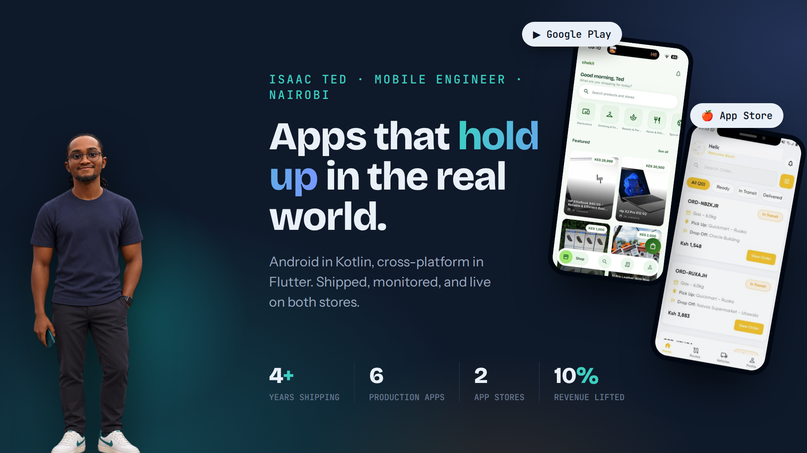

<h1 align="center">Hi, I'm Isaac 👋</h1>

<b>Mobile Engineer · Android (Kotlin) & Flutter · Nairobi, Kenya</b>

  
  
  
  

I build production mobile apps: ride-hailing used by thousands of people daily, POS terminals taking Visa, Mastercard and M-Pesa, NFC tap-to-pay, and offline-first apps for places with no signal. Co-founder of **Chekit**, a three-app commerce marketplace for Kenyan SMEs. My work is live on both Google Play and the App Store.

## 📱 Shipped apps

| App | What it is | Where it lives |
|---|---|---|
| **Chekit** | Commerce marketplace with M-Pesa escrow: customer, merchant and rider apps (co-founder) | [Google Play](TODO-chekit-play-link) · [App Store](TODO-chekit-appstore-link) |
| **RoadRims Driver** | Driver logistics: orders, live tracking, in-app loans. One Flutter codebase | [Google Play](TODO-roadrims-play-link) · [App Store](TODO-roadrims-appstore-link) |
| **Tourist Tap** | Visitors pay Kenyan merchants by tapping a card on a phone (NFC, EMV) | [Google Play](https://play.google.com/store/search?q=tourist%20tap&c=apps) |
| **Little Cab** | Feature and performance work on a national ride-hailing platform | [Google Play](https://play.google.com/store/apps/details?id=com.craftsilicon.littlecabrider) |
| **Little PDQ** | Point-of-sale on Android payment terminals, built to EMV Level 2 and PCI DSS | POS hardware, Kenya |
| **E-Voucher** | Offline-first fertilizer subsidy distribution via NFC tags | Government deployment, Ethiopia |

## 🛠 What I work with

**Mobile**

  
  
  
  
  

**Payments & hardware**

  
  
  
  

**Architecture, data & delivery**

  
  
  
  
  
  

## 🔭 Currently building

- An open-source **M-Pesa Daraja integration library for Kotlin**, so payments in East African apps stop being everyone's private headache. Watch this space.

## 📫 Find me

**[isaacted.dev/](https://isaacted.dev/)** is the full picture: case studies, screenshots, and how I work. Or just say hi: **ndeited@gmail.com**.
